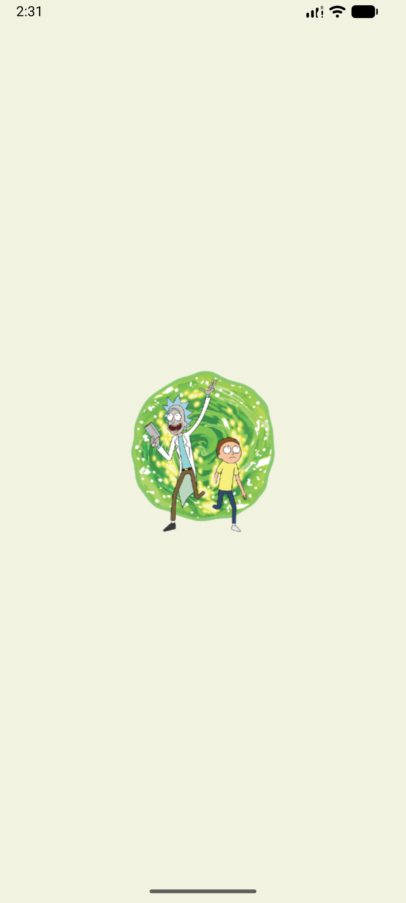
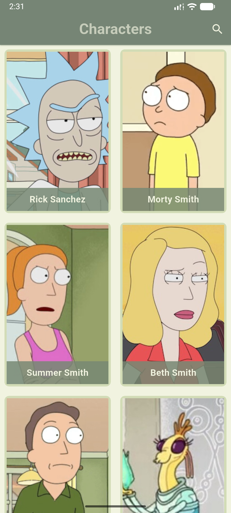
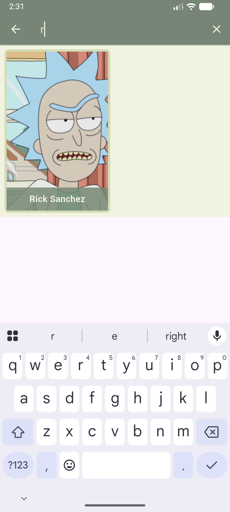
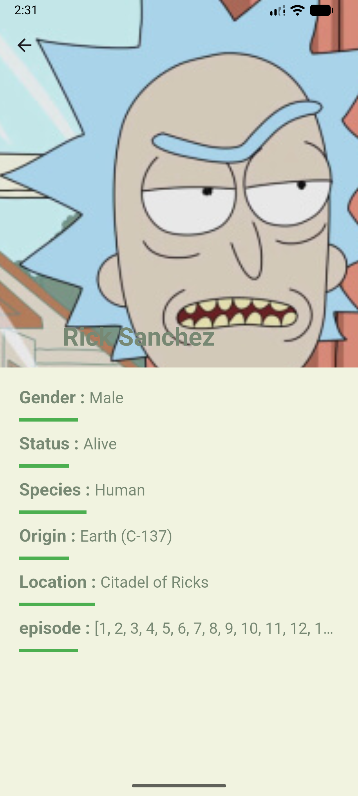

# 🛸 Rick and Morty Flutter App

A beautiful, feature-rich Flutter application that brings the Rick and Morty universe to your fingertips. Browse through characters from the show with smooth animations, detailed information, and offline support.


<div align="center">
  
</div>

## 📱 Project Overview

This mobile application leverages the [Rick and Morty API](https://rickandmortyapi.com/) to display a comprehensive list of characters from the popular animated series. Built with Flutter and following clean architecture principles, the app provides an intuitive and responsive user experience across both iOS and Android platforms.

## ✨ Features

- **Character Gallery**: Browse through all Rick and Morty characters in a beautiful grid layout
- **Real-time Search**: Instantly search for characters by name
- **Detailed Character Info**: View comprehensive character details including:
  - Status (Alive, Dead, Unknown)
  - Species and Gender
  - Origin and Current Location
  - Episode appearances
- **Smooth Animations**: Engaging text animations and hero transitions
- **Offline Support**: Graceful handling of network connectivity issues
- **Custom Splash Screen**: Native splash screens for both Android 11/12+ and iOS
- **Responsive Design**: Optimized for various screen sizes

## 🛠️ Tech Stack

### Core Framework
- **Flutter** (SDK ^3.9.2) - Cross-platform UI framework
- **Dart** - Programming language

### State Management
- **flutter_bloc** (^7.0.0) - Business Logic Component pattern
- **bloc** - Reactive state management

### Networking
- **dio** (^5.9.0) - HTTP client for API requests

### UI/UX Enhancements
- **animated_text_kit** (^4.3.0) - Text animations
- **flutter_offline** (^6.0.0) - Network connectivity monitoring
- **flutter_native_splash** (^2.4.7) - Native splash screen configuration

### Development Tools
- **flutter_launcher_icons** (^0.14.4) - App icon generation
- **flutter_lints** (^5.0.0) - Linting rules
- **rename_app** (^1.6.5) - App rename utility

## 🏗️ Architecture

The project follows **Clean Architecture** principles with clear separation of concerns:

```
lib/
├── business_logic/          # Business Logic Layer
│   └── cubit/              # State management (Cubit pattern)
│       ├── charachters_cubit.dart
│       └── charachters_state.dart
│
├── data/                    # Data Layer
│   ├── api/                # API communication
│   │   └── charachters_api.dart
│   ├── models/             # Data models
│   │   └── charachters_model.dart
│   └── repositories/       # Repository pattern
│       └── charachters_repository.dart
│
├── presentation/            # Presentation Layer
│   ├── screens/            # App screens
│   │   ├── charachters_screen.dart
│   │   └── charachter_details_screen.dart
│   └── widgets/            # Reusable widgets
│       ├── charachter_item.dart
│       ├── charachter_info.dart
│       └── buildnointernet_widget.dart
│
├── constants/              # App-wide constants
│   ├── appcolors.dart
│   └── strings.dart
│
├── app_router.dart         # Navigation routing
└── main.dart              # App entry point
```

### Architecture Layers

**1. Data Layer**
- **API Client**: Handles HTTP requests to the Rick and Morty API
- **Models**: Defines data structures with JSON serialization
- **Repository**: Abstracts data sources and provides clean data to business logic

**2. Business Logic Layer**
- **Cubit**: Manages application state using the BLoC pattern
- **States**: Defines different states (Initial, Loaded, Error)

**3. Presentation Layer**
- **Screens**: Full-page views (Characters list, Character details)
- **Widgets**: Reusable UI components
- **Routing**: Centralized navigation management

## 🎨 Color Palette

```dart
Main Grey:     #F1F3E0
Mint Green:    #D2DCB6
Sage:          #A1BC98
Dark Sage:     #778873
Contrast:      Green (Material)
```

## 📂 Folder Structure

```
rickandmorty/
├── android/                 # Android-specific files
├── ios/                     # iOS-specific files
├── lib/                     # Main application code
│   ├── business_logic/
│   ├── constants/
│   ├── data/
│   ├── presentation/
│   ├── app_router.dart
│   └── main.dart
├── test/                    # Unit and widget tests
├── assets/                  # Images, icons, and other assets
│   ├── icons/
│   └── images/
├── demo/                    # Demo screenshots and GIFs
│   ├── demo.gif
│   └── screenshots/
├── pubspec.yaml            # Project dependencies
└── README.md               # This file
```

## 🚀 How to Run the Project

### Prerequisites

- Flutter SDK (^3.9.2)
- Dart SDK
- Android Studio / Xcode (for emulators)
- VS Code or Android Studio (recommended IDEs)

### Installation Steps

1. **Clone the repository**
   ```bash
   git clone https://github.com/yourusername/rickandmorty-flutter.git
   cd rickandmorty-flutter
   ```

2. **Install dependencies**
   ```bash
   flutter pub get
   ```

3. **Generate splash screens** (optional)
   ```bash
   flutter pub run flutter_native_splash:create
   ```

4. **Generate app icons** (optional)
   ```bash
   flutter pub run flutter_launcher_icons
   ```

5. **Run the app**
   ```bash
   # Check available devices
   flutter devices
   
   # Run on connected device/emulator
   flutter run
   
   # Run in release mode
   flutter run --release
   ```

### Build for Production

**Android (APK)**
```bash
flutter build apk --release
```

**Android (App Bundle)**
```bash
flutter build appbundle --release
```

**iOS**
```bash
flutter build ios --release
```

## 🧪 Testing

The project includes a test suite using Flutter's testing framework:

```bash
# Run all tests
flutter test

# Run tests with coverage
flutter test --coverage

# Run specific test file
flutter test test/widget_test.dart
```

## 🔄 API Integration

The app uses the public [Rick and Morty API](https://rickandmortyapi.com/api/):

- **Base URL**: `https://rickandmortyapi.com/api/`
- **Endpoint Used**: `/character`
- **Response Handling**: Automatic JSON parsing with error handling
- **Timeout**: 20 seconds for both connection and data reception

## 🌐 Offline Capabilities

The app gracefully handles network connectivity issues:

- Real-time connectivity monitoring
- User-friendly offline UI with custom illustration
- Automatic reconnection detection
- Cached UI state during network transitions

## 🎯 Future Improvements

- [ ] **Pagination**: Implement infinite scroll for character list
- [ ] **Favorites**: Allow users to save favorite characters locally
- [ ] **Episode Details**: Add episode information screen
- [ ] **Location Browser**: Browse locations from the series
- [ ] **Dark Mode**: Add theme switching support
- [ ] **Unit Tests**: Expand test coverage for business logic
- [ ] **Integration Tests**: Add end-to-end testing
- [ ] **Localization**: Support multiple languages
- [ ] **Filtering**: Filter characters by status, species, and gender
- [ ] **Share Feature**: Share character cards on social media
- [ ] **Caching**: Implement local database for offline browsing

## 📸 Screenshots

<div align="center">
  <h3>Application Preview</h3>
  <p>Explore the beautiful interface and smooth interactions</p>
  
  <table>
    <tr>
      <td align="center">
        <br/>
        <b>Splash Screen</b>
      </td>
      <td align="center">
        <br/>
        <b>Characters List</b>
      </td>
      <td align="center">
        <br/>
        <b>Search Feature</b>
      </td>
    </tr>
    <tr>
      <td align="center">
        <br/>
        <b>Character Details</b>
      </td>
      <td align="center">
        <br/>
        <b>Live Demo</b>
      </td>
    </tr>
  </table>
</div>

## 🤝 Contributing

Contributions, issues, and feature requests are welcome! Feel free to check the [issues page](https://github.com/yourusername/rickandmorty-flutter/issues).

1. Fork the project
2. Create your feature branch (`git checkout -b feature/AmazingFeature`)
3. Commit your changes (`git commit -m 'Add some AmazingFeature'`)
4. Push to the branch (`git push origin feature/AmazingFeature`)
5. Open a Pull Request

## 📄 License

This project is licensed under the MIT License - see the [LICENSE](LICENSE) file for details.

## 👨‍💻 Author

**Hossam Yasser Abdelhady**  
📱 Cross-platform Mobile App Developer | Flutter | Dart  
💼 Passionate about creating modern, efficient, and user-friendly mobile applications.  

* 💼 [LinkedIn](https://www.linkedin.com/in/hossam-yasser-abdelhady/)
* 🐙 [GitHub](https://github.com/Hossam-Yaser)
* ✉️ Email: [hossamabdelhady000@gmail.com](hossamabdelhady000@gmail.com)
---


<div align="center">

### 🌟 If you like this project, please give it a star! 🌟

[](https://github.com/Hossam-Yaser)
[](https://www.linkedin.com/in/hossam-yasser-abdelhady/)

**Made with ❤️ and Flutter**

</div>
